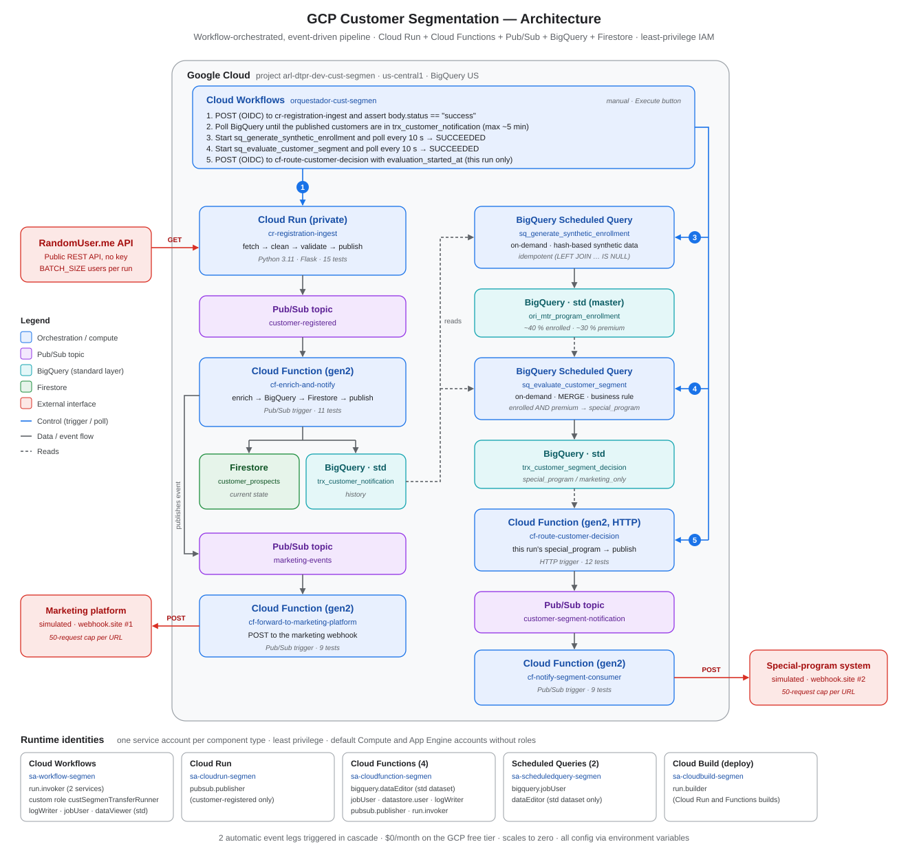
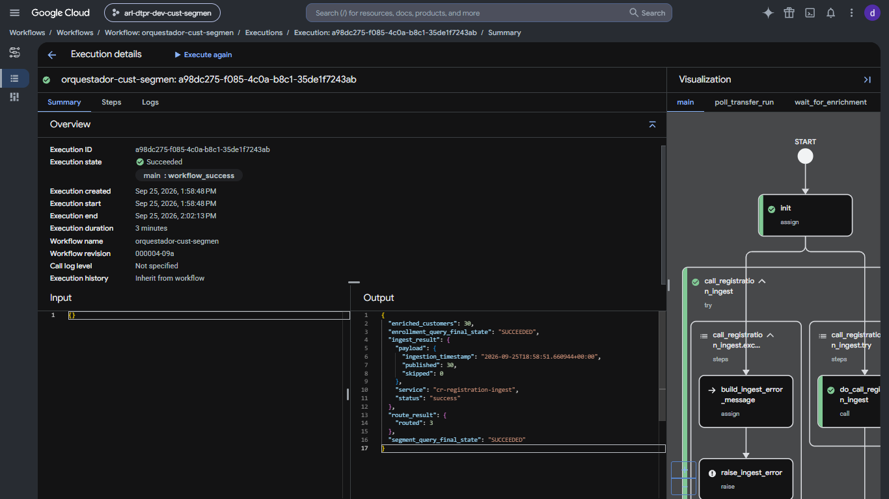
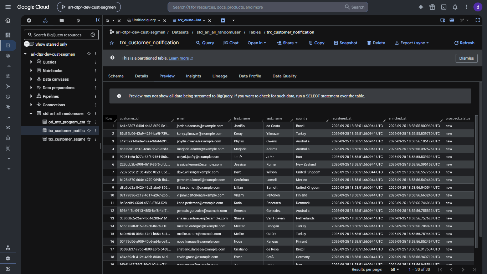
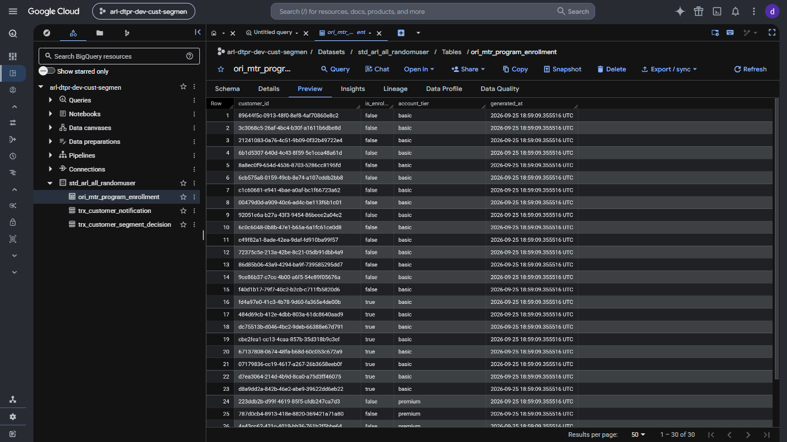
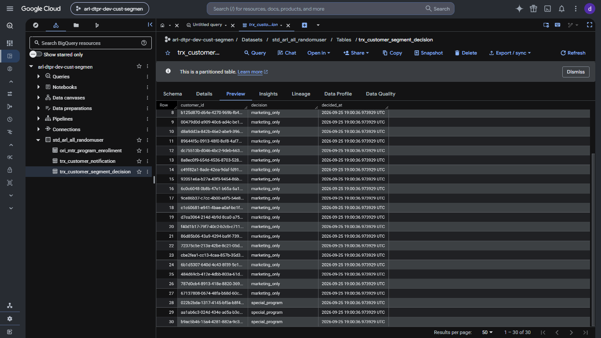
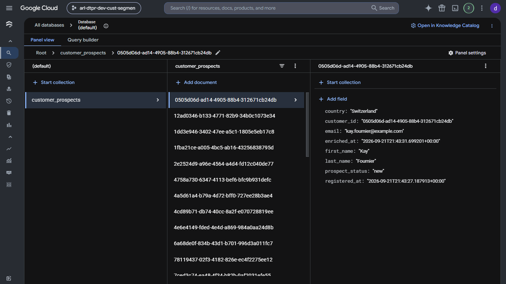
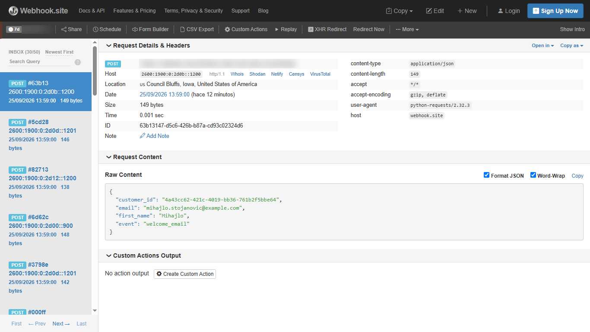
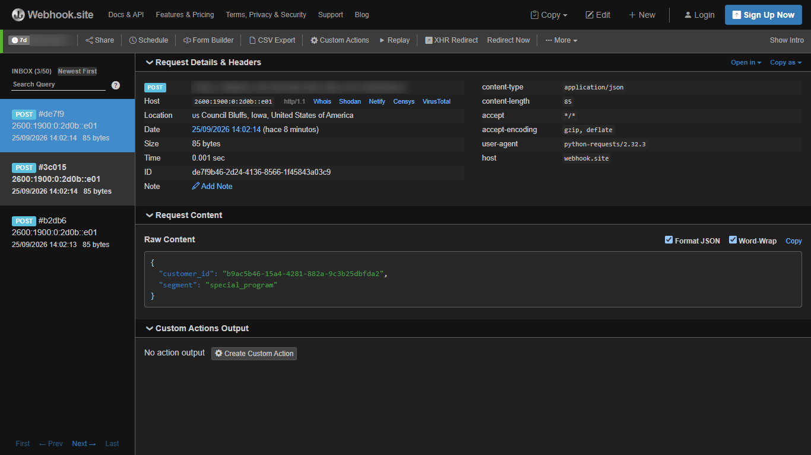

# GCP Customer Segmentation Pipeline


An event-driven customer pipeline on Google Cloud. It registers customers from a public API, enriches and stores them (BigQuery for history, Firestore for current state), notifies a marketing platform, applies a business rule to split customers into **`special_program`** or **`marketing_only`**, and notifies an external system only about the special-program customers.

A **Cloud Workflow** runs the whole process in one execution. It calls private services with OIDC, waits for the asynchronous Pub/Sub leg to land in BigQuery, runs two BigQuery scheduled queries in order, and routes only the decisions made in that run.



---

## Highlights

- **Event-driven with verified orchestration.** Three Pub/Sub topics and four Cloud Functions (gen2) form two automatic legs. The Workflow does not assume the async leg has finished: it polls BigQuery until every published customer has been enriched, with a timeout and an explicit error.
- **Hot and cold storage.** Firestore keeps the current state of each prospect (upsert by `customer_id`); BigQuery keeps the full history, partitioned and clustered.
- **Business rule in SQL, idempotent.** Deterministic synthetic attributes are generated in BigQuery (`FARM_FINGERPRINT`, one independent hash per attribute), and the segment decision is written with `MERGE ... WHEN NOT MATCHED`.
- **Exactly-this-run notifications.** The Workflow sends the evaluation start time to the routing function, so each run notifies only its own new `special_program` customers.
- **Private by default, least privilege.** Everything requires authentication. There is one service account per component type, dataset-scoped BigQuery grants via DCL, a custom role to start scheduled queries, and no component running as the default Compute or App Engine accounts.
- **Tested, config-driven code.** 56 unit tests across one Cloud Run service and four Cloud Functions, with GCP clients mocked. Every setting comes from environment variables; webhook URLs are injected at deploy time.

## How a run works

| Step | Component | What happens |
|---|---|---|
| 1 | Workflow → Cloud Run `cr-registration-ingest` | `POST` with OIDC. The service pulls `BATCH_SIZE` profiles from RandomUser.me, validates them and publishes one event per customer to **`customer-registered`**. The Workflow requires `body.status == "success"`. |
| ↳ | `cf-enrich-and-notify` (Pub/Sub) | Enriches each customer, inserts it into BigQuery **`trx_customer_notification`**, upserts it into Firestore **`customer_prospects`** and publishes to **`marketing-events`**. |
| ↳ | `cf-forward-to-marketing-platform` (Pub/Sub) | `POST`s a `welcome_email` event to the marketing platform (webhook #1). |
| 2 | Workflow → BigQuery | Polls `trx_customer_notification` every 10 s until the enriched count matches `published`, failing explicitly after the configured attempts. |
| 3 | Scheduled query `sq_generate_synthetic_enrollment` | Generates `is_enrolled_program` (~40 %) and `account_tier` (~30 % premium) for new customers, into **`ori_mtr_program_enrollment`**. The Workflow polls until `SUCCEEDED`. |
| 4 | Scheduled query `sq_evaluate_customer_segment` | `MERGE` applying the rule `enrolled AND premium → special_program` (≈12 %), else `marketing_only`, into **`trx_customer_segment_decision`**. The Workflow records the start time and polls until `SUCCEEDED`. |
| 5 | Workflow → `cf-route-customer-decision` (HTTP) | `POST` with OIDC and `evaluation_started_at`. The function selects this run's `special_program` customers and publishes each one to **`customer-segment-notification`**. |
| ↳ | `cf-notify-segment-consumer` (Pub/Sub) | `POST`s each special-program customer to the external system (webhook #2). |

Verification run (30 customers):

```json
{
  "ingest_result": { "status": "success", "payload": { "published": 30, "skipped": 0 } },
  "enriched_customers": 30,
  "enrollment_query_final_state": "SUCCEEDED",
  "segment_query_final_state": "SUCCEEDED",
  "route_result": { "routed": 3 }
}
```

30 customers in each of the three tables; 27 `marketing_only` and 3 `special_program`; 30 requests on the marketing webhook and exactly 3 on the special-program webhook.

## Data model

| Store | Object | Grain | Notes |
|---|---|---|---|
| BigQuery | `std_arl_all_randomuser.trx_customer_notification` | One row per enriched customer | History. Partitioned by `DATE(registered_at)`, clustered by `customer_id` |
| BigQuery | `std_arl_all_randomuser.ori_mtr_program_enrollment` | One row per customer | Synthetic, deterministic business attributes (no real or financial data). Idempotent insert (`LEFT JOIN … IS NULL`) |
| BigQuery | `std_arl_all_randomuser.trx_customer_segment_decision` | One decision per customer | `special_program` / `marketing_only`. Partitioned by `DATE(decided_at)` |
| Firestore | `customer_prospects` (database `(default)`) | One document per customer | Current state, upserted with `merge=True` |

## Security & IAM

| Service account | Used by | Grants |
|---|---|---|
| `sa-workflow-segmen` | Cloud Workflows | `run.invoker` on the 2 services it calls, custom `custSegmenTransferRunner` (start and read scheduled-query runs), `bigquery.jobUser`, `dataViewer` on the dataset, `logging.logWriter` |
| `sa-cloudrun-segmen` | Cloud Run | `pubsub.publisher` on `customer-registered` only |
| `sa-cloudfunction-segmen` | 4 Cloud Functions + their Eventarc triggers | `dataEditor` on the dataset only, `bigquery.jobUser`, `datastore.user`, `logging.logWriter`, `pubsub.publisher` on its 2 output topics, `run.invoker` on the 3 event-triggered functions |
| `sa-scheduledquery-segmen` | 2 scheduled queries | `bigquery.jobUser`, `dataEditor` on the dataset only |
| `sa-cloudbuild-segmen` | Cloud Build (all deploys) | `run.builder` |

The default Compute and App Engine service accounts had `roles/editor`; both were removed and nothing runs as them. This was verified with `INFORMATION_SCHEMA.JOBS_BY_PROJECT` (scheduled-query jobs run as `sa-scheduledquery-segmen`), Cloud Build history (builds run as `sa-cloudbuild-segmen`) and a successful end-to-end run.

## Evidence

Screenshots from the verification run (webhook URLs blurred).

| | |
|---|---|
| **Workflow run: `Succeeded`**, 30 published = 30 enriched, `routed: 3` <br>  | **`trx_customer_notification`**: 30 enriched customers <br>  |
| **`ori_mtr_program_enrollment`**: 30 rows, all four enrolled/tier combinations <br>  | **`trx_customer_segment_decision`**: 30 decisions, 3 `special_program` <br>  |
| **Firestore `customer_prospects`**: current state per customer <br>  | **Marketing webhook**: 30 `welcome_email` events <br>  |
| **Special-program webhook**: exactly 3 notifications <br>  | |

## Repository structure

```
.
├── cloud-run/cr-registration-ingest/          # Flask service (Python 3.11): fetch → validate → publish · 15 tests
├── cloud-functions/
│   ├── cf-enrich-and-notify/                  # Pub/Sub → BigQuery + Firestore + Pub/Sub · 11 tests
│   ├── cf-forward-to-marketing-platform/      # Pub/Sub → webhook #1 · 9 tests
│   ├── cf-route-customer-decision/            # HTTP → Pub/Sub (this run's special_program) · 12 tests
│   └── cf-notify-segment-consumer/            # Pub/Sub → webhook #2 · 9 tests
├── bigquery/                                  # DDL for the 3 tables
├── scheduled-queries/                         # synthetic enrollment + segment MERGE
├── workflow/                                  # orquestador-cust-segmen.yaml + env.yaml
├── docs/                                      # technical document, service accounts, IAM hardening, costs (Spanish)
└── images/                                    # architecture diagram and run evidence
```

## Deploying it

The full guide, with every `gcloud` / `bq` command, is in [`docs/technical-document-es.md`](docs/technical-document-es.md). Service accounts are detailed in [`docs/service-accounts-es.md`](docs/service-accounts-es.md) and the IAM hardening in [`docs/iam-hardening-es.md`](docs/iam-hardening-es.md) (all in Spanish). In short:

1. Enable the APIs, create the Firestore `(default)` database with `gcloud`, the 3 Pub/Sub topics, the dataset and the 3 tables.
2. Create the 5 service accounts and their grants (dataset-scoped via `GRANT ... ON SCHEMA`).
3. Deploy the Cloud Run service and the 4 Cloud Functions with `--no-allow-unauthenticated` and `--build-service-account`; grant `run.invoker`.
4. Create the 2 on-demand scheduled queries with `sa-scheduledquery-segmen`.
5. Create the Workflow with the variables in [`workflow/env.yaml`](workflow/env.yaml) and run it with **Execute**.

Run the tests of any component:

```bash
cd cloud-functions/cf-route-customer-decision   # or any other component
pip install -r requirements.txt pytest
pytest
```

## Lessons learned

| Symptom | Root cause | Fix |
|---|---|---|
| 30 customers in `trx_customer_notification` but only 11 with a decision | The Pub/Sub leg is asynchronous and the scheduled queries started ~3 s after ingestion | A Workflow step that polls BigQuery until `enriched == published`, with a timeout |
| ~30 % of customers in `special_program` instead of ~12 % | Both synthetic attributes used the same hash, so every premium customer was also enrolled | One independent hash per attribute (`customer_id` + a distinct salt) |
| The external system received the same customers again on every run | Routing selected all of today's `special_program` decisions | The Workflow passes `evaluation_started_at`; the function filters `decided_at >=` it |
| Eventarc trigger fails with `401 The request was not authenticated` | A gen2 function runs on an internal Cloud Run service that needs `run.invoker` for the trigger identity | Grant `run.invoker` on each event-triggered function |
| Firestore data not visible to the code / not free-tier eligible | Typing `default` in the console creates a *named* database, not `(default)` | Create the database with `gcloud` without `--database` |
| Webhook returns `429 Request limit exceeded` permanently | webhook.site caps each free URL at 50 requests | New URLs per test round; `BATCH_SIZE` kept small |
| A scheduled query started running every hour | Saving its service account in the console also saved the schedule section | Set **Repeat frequency = On-demand** before saving |
| `403 insufficient_scope` from the Workflow | Trailing `/` in the Cloud Run URL, so the OIDC audience did not match | Build the URL without a trailing slash |

## Roadmap

- [ ] Dead-letter topics for the webhook subscriptions (today a failed webhook call is not retried)
- [ ] Return `400` instead of `500` when `evaluation_started_at` has an invalid format
- [ ] Infrastructure as code (Terraform)
- [ ] CI with GitHub Actions running the 56 tests on every push

## Author

**Alvaro Yalle**, Senior Data Engineer (GCP · Azure · AWS)
[GitHub](https://github.com/ayalle2024) · [LinkedIn](https://www.linkedin.com/in/alvaro-luis-yalle-yalli-425b2162) · [Upwork](https://www.upwork.com/freelancers/~01d7539a2f4ec94842) · alvaroyalle@yahoo.es
